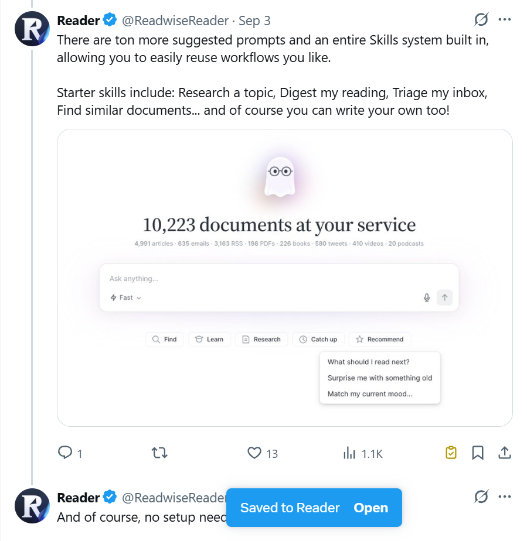
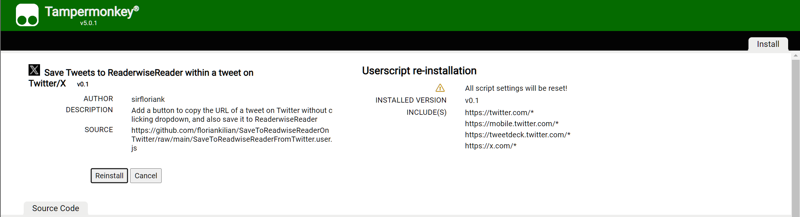
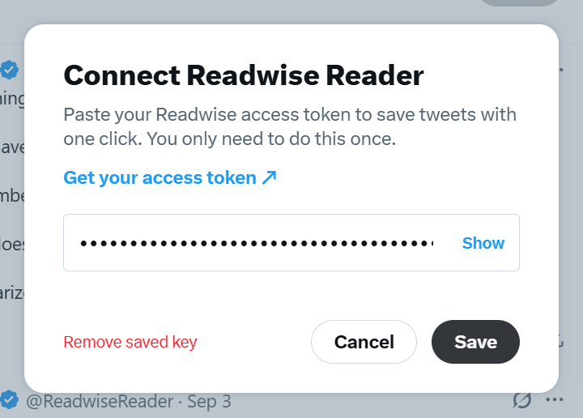
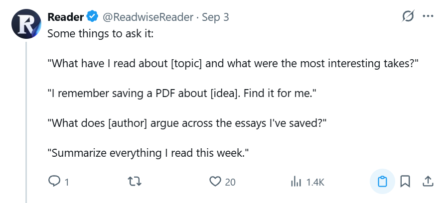

# Save Tweets to Readwise Reader

[](https://www.tampermonkey.net/) [](https://greasyfork.org/de/scripts/597358-save-tweets-to-readwise-reader) [](https://github.com/floriankilian/SaveToReadwiseReaderOnTwitter/actions/workflows/lint.yml) [](https://github.com/floriankilian/SaveToReadwiseReaderOnTwitter/blob/main/LICENSE)

A userscript that adds a save button to every tweet on Twitter/X. One click saves the tweet to [Readwise Reader](https://readwise.io/read).



## Features

- **One click per tweet:** the button sits in the tweet's action bar, next to Bookmark.
- **Clear feedback:** the button shows when a save is in progress, done or failed, and a short message confirms it, with a link to open the tweet in Reader.
- **No duplicates to worry about:** if a tweet is already in your library, you're told so.
- **Guided setup:** the first click asks for your Readwise access token, checks it with Readwise, and remembers it.
- **Notes per tweet:** Shift+Click (⇧ Shift+Click on Mac) to add a note and tags to the tweet you're saving.
- **Optional settings:** Alt+Click (⌥ Option+Click on Mac) to choose where tweets land in Reader, add default tags, or also copy the tweet link to your clipboard. Everything extra is off by default.
- **See what you saved (beta):** optionally mark tweets you already saved with this browser in yellow.
- **Fits into X:** follows X's light, dim and dark themes, and works with both X's current and its newer layout.

## How it differs from Readwise's built-in X import

Readwise has its own [X/Twitter integration](https://docs.readwise.io/readwise/docs/importing-highlights/twitter). Once you connect your X account, it imports **all your bookmarks** once a day, and you can save tweets by replying **@readwise save** (or **@readwise save thread**) or by sending them to @readwise in a DM.

This script is for when you want to **pick which tweets go to Reader**, without mixing that up with your bookmarks:

| | This script | Readwise's X integration |
|---|---|---|
| **What gets saved** | Only the tweets whose button you click | Every bookmark, plus tweets you send to @readwise |
| **Your X bookmarks** | Stay separate. Bookmark freely without filling your Reader library | Imported automatically (on by default) |
| **When it arrives** | Right away | Bookmarks: once a day |
| **Visible to others** | No, nothing is posted on X | An **@readwise save** reply is a public tweet |
| **Connecting your X account** | Not needed; only a Readwise access token | Required |
| **Per-save options** | Note, tags, and Inbox, Later or Archive | A note via the DM text |
| **Where it works** | Desktop browser with Tampermonkey | Anywhere you use X, including the mobile app |

You can use both: for example, turn off the bookmark import in Readwise (Dashboard → Import → Twitter) and use this button for the tweets you actually want to read later.

## Install

Install the [Tampermonkey](https://www.tampermonkey.net/) browser extension first, then pick one option:

- **Greasy Fork (recommended):** install from [Greasy Fork](https://greasyfork.org/de/scripts/597358-save-tweets-to-readwise-reader). Updates arrive automatically.
- **GitHub:** open the [raw script](https://raw.githubusercontent.com/floriankilian/SaveToReadwiseReaderOnTwitter/main/SaveToReadwiseReaderFromTwitter.user.js) and click **Install** when Tampermonkey asks. Updates come from this repository's `main` branch.



**Chrome users:** recent Chrome versions only run userscripts if you allow it. Open `chrome://extensions`, click **Details** on Tampermonkey, and turn on **Allow User Scripts**.

## Setup

1. Open Twitter/X and click the save button on any tweet.
2. A **Connect Readwise Reader** dialog opens. Click **Get your access token** to open [readwise.io/access_token](https://readwise.io/access_token), and copy your token.
3. Paste it into the dialog and click **Save**. The token is checked with Readwise right away, and the tweet you clicked is saved.



To change or remove the token later, open the [settings](#settings): **Alt+Click** (**⌥ Option+Click** on Mac) any save button, or use **Settings…** in the Tampermonkey menu.

## Usage

Click the save button on a tweet. It sits in the action bar, right before Bookmark:



The button shows what's happening:

| Button | Meaning |
|---|---|
| Gray | Not saved yet |
| Blue, pulsing | Saving… |
| Yellow with a check mark | Saved to Reader. With the [beta setting](#settings) on, tweets you saved before with this browser also show up yellow |
| Red with an exclamation mark | Couldn't save. The message says why; click **Retry** or the button again |

| Windows / Linux | Mac | What it does |
|---|---|---|
| **Click** | **Click** | Save the tweet |
| **Shift+Click** | **⇧ Shift+Click** | Save the tweet with a note and tags |
| **Alt+Click** | **⌥ Option+Click** | Open the settings, including your Readwise access token |
| **Ctrl+Enter** | **⌘ Cmd+Enter** | In the note dialog: save |

The button's tooltip and the dialogs show the key names for your system.

### Save with a note

1. **Shift+Click** (**⇧ Shift+Click** on Mac) the save button.
2. Write your note. The tags field starts with your default tags from the settings; change them for this tweet if you like.
3. Click **Save to Reader**, or press **Ctrl+Enter** (**⌘ Cmd+Enter** on Mac).

Notes and tags are meant for tweets that are new to your library. If the tweet is already there, they may not be added, so the message links you to the tweet in Reader to add the note yourself.

## Settings

Open the settings with **Alt+Click** (**⌥ Option+Click** on Mac) on any save button, or with **Settings…** in the Tampermonkey menu. All options are optional; by default a click only saves the tweet.

| Setting | Default | What it does |
|---|---|---|
| Readwise access token | Set during setup | Paste a new token to replace it, or remove it. A new token is checked with Readwise when you click **Save** |
| Copy the tweet link to the clipboard | Off | Also copies the tweet's link when you save it |
| Save to | Inbox | Where new tweets land in Reader: Inbox, Later or Archive |
| Tags | None | Comma-separated tags added to every saved tweet. You can change them per tweet with Shift+Click |
| Show tweets you saved before (beta) | Off | Marks tweets you already saved in yellow when you see them again |

**About "Show tweets you saved before":** this is a beta feature with a deliberate limit. It only knows about tweets you saved **with this script, in this browser, on this computer**. Nothing is synced with Readwise or your other devices, so tweets you saved from the Reader app, another browser or another computer are not marked. The list of saved tweet IDs stays in Tampermonkey's storage in your browser, and **Forget remembered tweets** in the settings clears it.

## How it works, and what it can access

The whole script is a single file with no build step and no dependencies, so what you install is exactly [`SaveToReadwiseReaderFromTwitter.user.js`](SaveToReadwiseReaderFromTwitter.user.js) in this repository.

- **Where it runs:** only on `twitter.com`, `mobile.twitter.com`, `tweetdeck.twitter.com` and `x.com` pages.
- **What it reads:** only the link of the tweet whose button you click. It doesn't read your timeline, messages or account.
- **What it sends, and when:** nothing until you click. Then it makes one request to Readwise's [Reader API](https://readwise.io/reader_api) with the tweet's link, plus your tags, note and Reader location if you set them: `POST https://readwise.io/api/v3/save/`. When you enter a token, it checks it once with `GET https://readwise.io/api/v2/auth/`.
- **Who it talks to:** only `readwise.io`. Tampermonkey enforces this through the script's `@connect readwise.io` line.
- **Where your token is stored:** in Tampermonkey's storage for this script, in your browser. It is only ever sent to Readwise, to authorize your saves. You can remove it in the settings at any time.
- **What else it stores:** your settings and, only if you turn on the beta feature, the IDs of tweets you saved. Both stay in Tampermonkey's storage in your browser and are never sent anywhere.
- **No tracking:** no analytics, no third-party code, no data collection.

The Tampermonkey permissions it asks for, and why:

| Permission | Used for |
|---|---|
| `GM_getValue`, `GM_setValue` | Remembering your Readwise token, your settings and, if you turn it on, the tweets you saved |
| `GM_xmlhttpRequest` | Talking to the Readwise API. Regular page scripts on x.com can't contact other domains |
| `GM_registerMenuCommand` | The **Settings…** entry in the Tampermonkey menu |

## Troubleshooting

- **No save buttons appear:** check that Tampermonkey is allowed to run userscripts (see the Chrome note under [Install](#install)), and that the script is enabled in the Tampermonkey menu.
- **Still no buttons:** X may have changed its page structure. Open the browser console (F12). If you see a `[Save to Readwise Reader]` warning, please [open an issue](https://github.com/floriankilian/SaveToReadwiseReaderOnTwitter/issues).

## Known issues

- When you save a reply that's part of a thread, Reader may import the original thread instead of just the reply.

## Changelog

### 1.3.0

- **New settings dialog:** Alt+Click (⌥ Option+Click on Mac) a save button, or use **Settings…** in the Tampermonkey menu. It holds your Readwise access token and all options.
- **Save with a note:** Shift+Click (⇧ Shift+Click on Mac) to add a note and tags to a tweet.
- **Choose where tweets land:** Inbox, Later or Archive.
- **Default tags** for every saved tweet, empty unless you add some.
- **Beta: show tweets you saved before** with this browser, off by default.
- **Changed:** saving no longer copies the tweet link to your clipboard by default. Turn on **Also copy the tweet link to the clipboard** in the settings to get the old behavior back.
- **Changed:** the **Set Readwise API key…** menu entry is replaced by **Settings…**.
- **Fixed:** a double click no longer saves a tweet twice, and Shift+Click no longer selects text on the page.
- **Fixed:** tweets you already bookmarked now get the save button too, for example on a tweet's own page or in your history (`/i/history`).

## Development

The script is plain JavaScript in a single file. To work on it with instant reloads:

1. In `chrome://extensions`, open Tampermonkey's **Details** and turn on **Allow access to file URLs**.
2. Create a new script in Tampermonkey that loads your local copy. Tampermonkey ignores the header of a required file, so the `@grant`, `@connect` and `@match` lines must be in this loader:

   ```js
   // ==UserScript==
   // @name         [DEV] Save Tweets to Readwise Reader
   // @namespace    https://github.com/floriankilian/SaveToReadwiseReaderOnTwitter/dev
   // @version      0.0.0-dev
   // @match        https://twitter.com/*
   // @match        https://mobile.twitter.com/*
   // @match        https://x.com/*
   // @grant        GM_setValue
   // @grant        GM_getValue
   // @grant        GM_xmlhttpRequest
   // @grant        GM_registerMenuCommand
   // @connect      readwise.io
   // @require      file:///C:/path/to/SaveToReadwiseReaderOnTwitter/SaveToReadwiseReaderFromTwitter.user.js
   // ==/UserScript==
   ```

3. Disable the installed release version while developing, and reload X after each change.

Linting runs on every pull request. To run it locally:

```bash
npm install
npm run lint
```

## Credits

- [Readwise](https://readwise.io/) and its [Reader API](https://readwise.io/reader_api)
- [Tampermonkey](https://www.tampermonkey.net/)
- Inspired by [One Click Copy Link Button for Twitter](https://greasyfork.org/scripts/482477-one-click-copy-link-button-for-twitter-x)
- More tools for Readwise Reader: [awesome-readwise](https://github.com/Scarvy/awesome-readwise)
