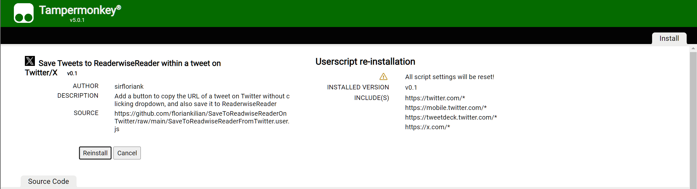
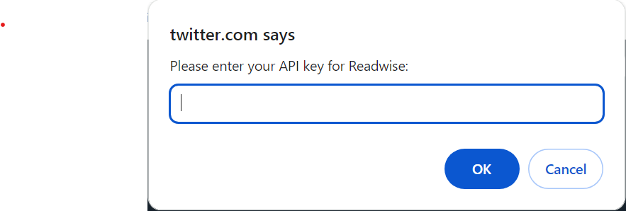
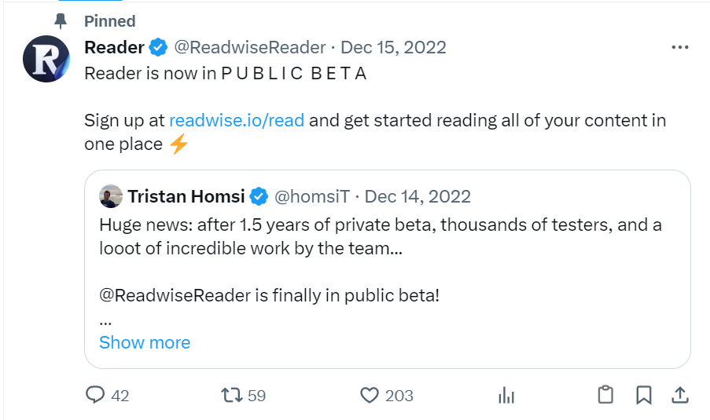

# Save Tweets to Readwise Reader with Tampermonkey

 

The "Save Tweets to Readwise Reader" userscript adds a button to every tweet on Twitter/X. One click copies the tweet's URL to your clipboard, without going through any dropdowns, and saves the tweet to [Readwise Reader](https://readwise.io/read).

## How to Install
### Setup of Tampermonkey and the Userscript
1. Install the [Tampermonkey](https://www.tampermonkey.net/) browser extension.
2. Open the script in [Raw View](https://raw.githubusercontent.com/floriankilian/SaveToReadwiseReaderOnTwitter/main/SaveToReadwiseReaderFromTwitter.user.js).
3. Tampermonkey will prompt you to install the userscript. Click Install.

The script updates itself from this repo whenever a new version is pushed (via the `@updateURL`/`@downloadURL` metadata).

### Get a Readwise API key
1. Get your Readwise [API key](https://readwise.io/access_token) and copy it to your clipboard.

### Configuration
1. Open any page on Twitter/X.
2. Alt-click (Option-click on Mac) the new clipboard icon to set your API key.

3. Paste the API key from your clipboard.
4. Voila!

## How to use
1. Click the clipboard icon. It turns blue once the link is copied to your clipboard, and yellow once the tweet has been saved to Readwise Reader. It turns red if something went wrong (e.g. no API key set).

## Possible future improvements:
- ~~Optimize API Key Handling~~
    - ~~checking for the API key only when the user decides to save a tweet to reduce potential annoyance~~
    - ~~update the stored API key without clearing browser data or changing Tampermonkey settings (e.g., Alt + Click on the save icon)~~
- ~~Improve Error Handling, e.g. red icon on an error~~
- Refactor and Modularize Code
- ~~Get the author of the tweet instead of "twitter.com"~~

## Known issues:
- If the selected tweet is a reply to another "thread"-tweet, the reply will be parsed by Reader instead of the "reply"-Tweet.
- Tweets can be saved multiple times, as there is currently no check whether the tweet was already saved.

## Credits
- [Readwise](https://readwise.io/)
- [Tampermonkey](https://tampermonkey.net/)
- [One Click Copy Link Button for Twitter](https://greasyfork.org/ckb/scripts/482477-one-click-copy-link-button-for-twitter-x/feedback)

## Find more useful tools for Readwise Reader
[awesome-readwise](https://github.com/Scarvy/awesome-readwise)
