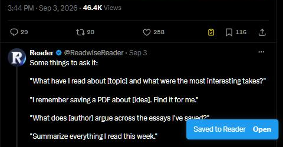

# Save Tweets to Readwise Reader

[](https://www.tampermonkey.net/) [](https://greasyfork.org/de/scripts/597358-save-tweets-to-readwise-reader) [](https://github.com/floriankilian/SaveToReadwiseReaderOnTwitter/actions/workflows/lint.yml) [](https://github.com/floriankilian/SaveToReadwiseReaderOnTwitter/blob/main/LICENSE)

A userscript that adds a save button to every tweet on Twitter/X. One click saves the tweet to [Readwise Reader](https://readwise.io/read) and copies its link to your clipboard.



## Features

- **One click per tweet:** the button sits in the tweet's action bar, next to Bookmark.
- **Clear feedback:** the button shows when a save is in progress, done or failed, and a short message confirms it, with a link to open the tweet in Reader.
- **No duplicates to worry about:** if a tweet is already in your library, you're told so.
- **Guided setup:** the first click asks for your Readwise access token, checks it with Readwise, and remembers it.
- **Fits into X:** follows X's light, dim and dark themes, and works with both X's current and its newer layout.

## Install

Install the [Tampermonkey](https://www.tampermonkey.net/) browser extension first, then pick one option:

- **Greasy Fork (recommended):** install from [Greasy Fork](https://greasyfork.org/de/scripts/597358-save-tweets-to-readwise-reader). Updates arrive automatically.
- **GitHub:** open the [raw script](https://raw.githubusercontent.com/floriankilian/SaveToReadwiseReaderOnTwitter/main/SaveToReadwiseReaderFromTwitter.user.js) and click **Install** when Tampermonkey asks. Updates come from this repository's `main` branch.


**Chrome users:** recent Chrome versions only run userscripts if you allow it. Open `chrome://extensions`, click **Details** on Tampermonkey, and turn on **Allow User Scripts**.

## Setup

1. Open Twitter/X and click the save button on any tweet.
2. A **Connect Readwise Reader** dialog opens. Click **Get your access token** to open [readwise.io/access_token](https://readwise.io/access_token), and copy your token.
3. Paste it into the dialog and click **Save**. The token is checked with Readwise right away, and the tweet you clicked is saved.


To change or remove the token later, **Alt+Click** (Option+Click on Mac) any save button, or use **Set Readwise API key…** in the Tampermonkey menu.

## Usage

Click the save button on a tweet. It sits in the action bar, right before Bookmark:


The button shows what's happening:

| Button | Meaning |
|---|---|
| Gray | Not saved yet |
| Blue, pulsing | Saving… |
| Yellow with a check mark | Saved to Reader |
| Red with an exclamation mark | Couldn't save. The message says why; click **Retry** or the button again |

## How it works, and what it can access

The whole script is a single file with no build step and no dependencies, so what you install is exactly [`SaveToReadwiseReaderFromTwitter.user.js`](SaveToReadwiseReaderFromTwitter.user.js) in this repository.

- **Where it runs:** only on `twitter.com`, `mobile.twitter.com`, `tweetdeck.twitter.com` and `x.com` pages.
- **What it reads:** only the link of the tweet whose button you click. It doesn't read your timeline, messages or account.
- **What it sends, and when:** nothing until you click. Then it makes one request to Readwise's [Reader API](https://readwise.io/reader_api) with the tweet's link: `POST https://readwise.io/api/v3/save/`. When you enter a token, it checks it once with `GET https://readwise.io/api/v2/auth/`.
- **Who it talks to:** only `readwise.io`. Tampermonkey enforces this through the script's `@connect readwise.io` line.
- **Where your token is stored:** in Tampermonkey's storage for this script, in your browser. It is only ever sent to Readwise, to authorize your saves. You can remove it from the setup dialog at any time.
- **No tracking:** no analytics, no third-party code, no data collection.

The Tampermonkey permissions it asks for, and why:

| Permission | Used for |
|---|---|
| `GM_getValue`, `GM_setValue` | Remembering your Readwise token |
| `GM_xmlhttpRequest` | Talking to the Readwise API. Regular page scripts on x.com can't contact other domains |
| `GM_registerMenuCommand` | The **Set Readwise API key…** entry in the Tampermonkey menu |

## Troubleshooting

- **No save buttons appear:** check that Tampermonkey is allowed to run userscripts (see the Chrome note under [Install](#install)), and that the script is enabled in the Tampermonkey menu.
- **Still no buttons:** X may have changed its page structure. Open the browser console (F12). If you see a `[Save to Readwise Reader]` warning, please [open an issue](https://github.com/floriankilian/SaveToReadwiseReaderOnTwitter/issues).

## Known issues

- When you save a reply that's part of a thread, Reader may import the original thread instead of just the reply.

## Development

The script is plain JavaScript in a single file. To work on it with instant reloads:

1. In `chrome://extensions`, open Tampermonkey's **Details** and turn on **Allow access to file URLs**.
2. Create a new script in Tampermonkey that loads your local copy. Tampermonkey ignores the header of a required file, so the `@grant`, `@connect` and `@match` lines must be in this loader:

   ```js
   // ==UserScript==
   // @name         [DEV] Save Tweets to Readwise Reader
   // @namespace    https://github.com/floriankilian/SaveToReadwiseReaderOnTwitter/dev
   // @version      0.0.0-dev
   // @match        https://twitter.com/*
   // @match        https://mobile.twitter.com/*
   // @match        https://x.com/*
   // @grant        GM_setValue
   // @grant        GM_getValue
   // @grant        GM_xmlhttpRequest
   // @grant        GM_registerMenuCommand
   // @connect      readwise.io
   // @require      file:///C:/path/to/SaveToReadwiseReaderOnTwitter/SaveToReadwiseReaderFromTwitter.user.js
   // ==/UserScript==
   ```

3. Disable the installed release version while developing, and reload X after each change.

Linting runs on every pull request. To run it locally:

```bash
npm install
npm run lint
```

## Credits

- [Readwise](https://readwise.io/) and its [Reader API](https://readwise.io/reader_api)
- [Tampermonkey](https://www.tampermonkey.net/)
- Inspired by [One Click Copy Link Button for Twitter](https://greasyfork.org/scripts/482477-one-click-copy-link-button-for-twitter-x)
- More tools for Readwise Reader: [awesome-readwise](https://github.com/Scarvy/awesome-readwise)
