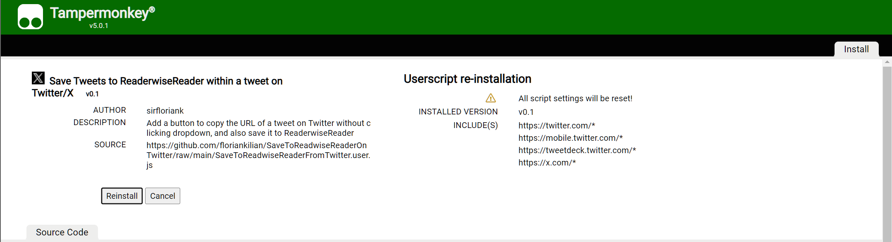

# Save Tweets to Readwise Reader with Tampermonkey
The "Save Tweets to Readwise" UserScript adds a convenient button to copy the URL tweet on Twitter without having to click through any dropdowns. Additionally provides the functionality to save to ReadwiseReader, a platform for organizing and remembering your highlights

## How to Install.
### Setup of Tampermonkey and the Userscript
1. Install [Tampermonkey](https://tampermonkey.net/).
2. Access the Script in [Raw View](https://github.com/floriankilian/SaveToReadwiseReaderOnTwitter/raw/main/SaveToReadwiseReaderFromTwitter.user.js).
3. Tampermonkey will prompt you to install the Userscript, click Install.

### Get a Readwise API key
1. Get your Readwise [API key](https://readwise.io/access_token), and copy it to your clipboard. 

### Configuration
1. Access any Twitter URL (x/twitter)
2. Click on the new copy icon with an alt-left-click (option on mac) to set your API key

3. Paste the API key from your clipboard.
4. Voila!

5. ON the first usage you will be requested to allow the domain. Click always allow domain.

## How to use
1. Click on the clipboard. It will change to blue if it is copied to clipboard and change to a yellow icon once it was send and saved sucessfully at Readwise Reader.

By following these simple installation steps, you can enhance your Twitter browsing experience by easily saving and sending tweets to Readwise.

## Possible future improvements:
- Optimize API Key Handling
    - checking for the API key only when the user decides to save a tweet to reduce potential annoyance
    - update the stored API key without clearing browser data or changing Tampermonkey settings (e.g., Alt + Click on the save icon).
- Improve Error Handling, e.g. red icon on an error
- Refactor and Modularize Code
- Add save (first) link from a tweet instead of tweet, (e.g., Shift + Click on the save icon)

## Possible future improvements:
- ~~Optimize API Key Handling~~
    - ~~checking for the API key only when the user decides to save a tweet to reduce potential annoyance~~
    - ~~update the stored API key without clearing browser data or changing Tampermonkey settings (e.g., Alt + Click on the save icon)~~
- ~~Improve Error Handling, e.g. red icon on an error~~
- Refactor and Modularize Code better
- Get the author of the tweet instead of "twitter.com"